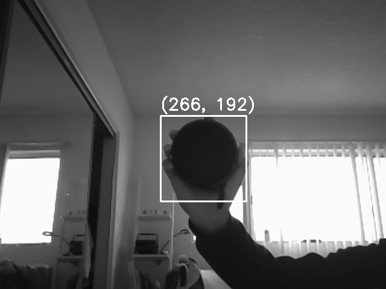

# 180DA-WarmUp
Grace Zhao, Group 5

<h3>Section 5.1:</h3>
    <ul>
        <li>convering to different color schemes</li>
        <li>thresholding</li>
        <li>edge detection</li>
        <li>template matching</li>
        <li>convex hulll/bounding box contours</li>
    </ul>

The images used and produced by the functions implemented in section 5.1 are located in the Images folder.

<h3>Section 5.2:</h3>
    <ul>
        <li>
            implemented a rudimentary object tracker using basic template matching 
        </li>
    </ul>
   
    

    The template image located in the Images folder.
