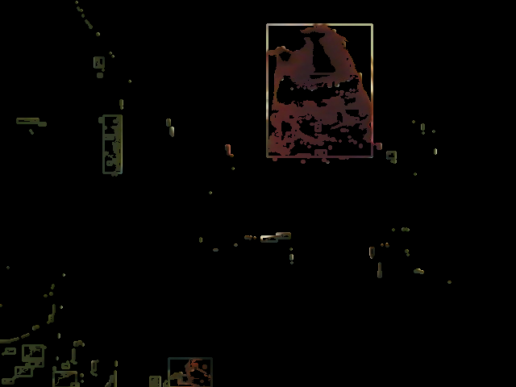
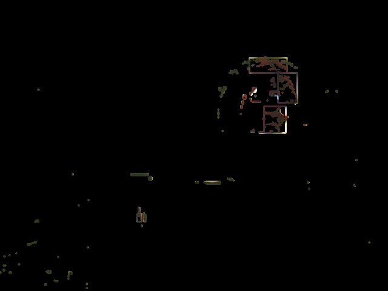
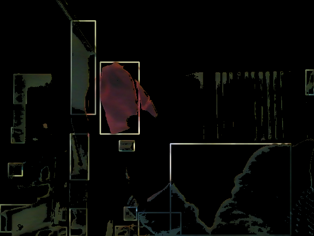
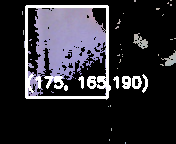

# 180DA-WarmUp
Grace Zhao, Group 5

<h3>Section 5.1:</h3>
    <ul>
        <li>convering to different color schemes</li>
        <li>thresholding</li>
        <li>edge detection</li>
        <li>template matching</li>
        <li>convex hulll/bounding box contours</li>
    </ul>

The images used and produced by the functions implemented in section 5.1 are located in the Images folder.

<h3>Section 5.2:</h3>
    <ul>
        <li>
            implemented a rudimentary object tracker using basic template matching 
        </li>
    </ul>
   
</img>

The template image is located in the Images folder.

<h3>Camera Exercises</h3>
    <ol>
        <li>
            <ul>
                <li>
                    HSV is typically better to use in image processing than RGB because it separates image intensity from color information. This makes objects in images robust to changes to lighting. 
                </li>
                <li>
                    In my specific case, the largest threshold range I used was a difference of ~90 values for the red channel. This value was determined through testing and tunning the thresholds for the specific lighting conditions of my video.
                </li>
            </ul>
            </img> 
        </li>
        <li>
            Due to my use pf RGB values, the color detector was sensitive to changes in light. The color detection worked best in medium-lit conditions. If the object was too close or too for away from my desk lamp, the color was not detected correctly.
            </img> 
        </li>
        <li>
            Using the color picker helped me to determine more accurately the range of RGB values I should use for the threshold. Due to the shape of my object, it was suceptible to having dark and light spots. Using the RGB picker helped me find the largest and smallest values I needed for each channel. However, because I increased the threshold ranges, that also caused the color detector to pick up background colors. 
            </img>
        </li>
        <li>
            </img>
        </li>
    </ol>
